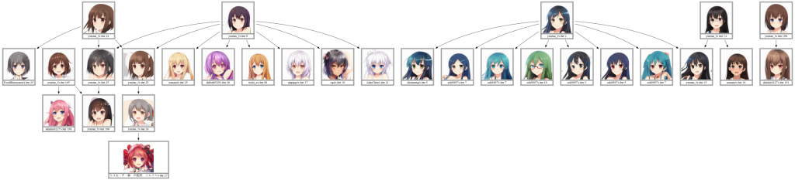

# CrypkoGraph (α) http://crypko.untan.xyz/
Generate your crypko tree graph on crypko.ai



## REQUIREMENTS
```bash
pip install bottle graphviz
apt install graphviz # Ubuntu/Debian
```

## USAGE
### via browser
1. Run `python3 main.py`
2. Open localhost:8080

### via Python interface
load `crypkograph.py` from Python interpreter.

## AUTHOR
yuntan_t

* mastodon: [@yuntan_t@mstdn.maud.io](https://mstdn.maud.io/@yuntan_t)
* Twitter: @yuntan_t
* **Donate crypko to 0xc4765a8cf0f2ab524ecfece14069bb7e3f5e8ec9**
